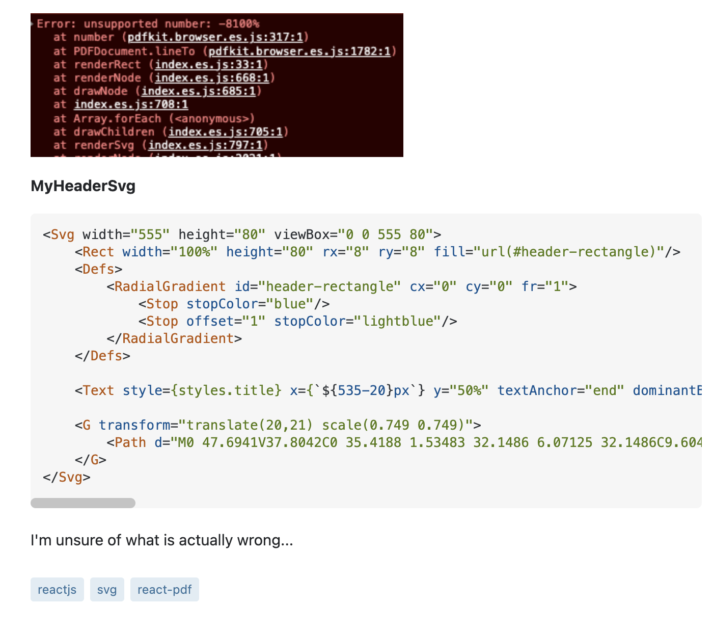

## Introduction to Bad Questions

If you were ever taught that there’s “no such thing as a bad question,” you were lied to. Imagine that one day you’ve been working on refining your code for a big project. Finally, after many waking hours of work, and many hours of sleep have been lost, you add the finishing touches and compile. You get no error messages and hit run, only to find out that your code runs, but the formatting and dimensions of the user interface are incorrect, the text fields aren’t displaying any information, your console is printing "System Cannot Find File Specified" exceptions from trying to access a seemingly non-existent file. The bottom line is, you need help. Rather than taking the time to analyze the issue, and craft a detailed inquiry, you hop onto Stack Overflow and frantically type out a question on the home page. “Text fields aren’t displaying data and my .img files aren’t being accessed. Is there anything I should look for?” There are so many things wrong with this type of question. It’s a terribly unspecific question that fails to explain the symptoms of the issue, any type of context about the task your code is supposed to complete, what systems you are using to debug your code, and so much more. You couldn’t even bother to take one minute and locate a space where your question could be more relevant, and therefore, increase your chances of receiving an answer. Not that this specific example would be an easy question to answer anyway. The nature of what we do as software developers demands a very large commitment of time, meaning that every minute is incredibly valuable. Answering the question “what should I look for” wastes those valuable minutes, which most people aren’t willing to give you. You’re not getting an answer. Even though you weren’t successful in your first attempt, there is still hope. As we examine a couple of real-life example questions, we’ll break down the strengths and weaknesses of both, and determine what constitutes each of them as “smart” or “not smart.”

## Recognize “Not smart” Questions

The following is a real-life Stack Overflow inquiry:

This is an amazing example of a “not smart” question. The first issue is the phrasing of the actual question: “I can’t find this information anywhere. Where is it?” Granted, the header for the question helps deduce the specific topic, the question is phrased in a total of nine words. The author could have written something along the lines of  “I can’t find the specific methods allowed for each ContentProviderOperation.Builder type that is being referenced. Are the methods displayed on the same page, or is there a separate page?” With this type of question, at least the reader is informed in a general sense of how the author arrived at the issue, and what they have already attempted in the way of solving the problem. Questions like these show that very minimal effort was put into explaining the issue, and expect the reader to fill in the blanks, then magically produce a solution. As I stated before, no developer competent enough to answer this question will be willing to spend their valuable time to interpret the actual issue and search this webpage for the answer. That is, unless they happen to be writing a technical essay about why this is such a bad question. I attempted to find an answer for this specific question, and discovered that it was not only a “not smart” question, it was a terrible one. The worst question a person could ask is one where the answer sits right in front of them. To specify, when I say “right in front of you,” I don’t mean that you have to use your intuition. I mean the literal written answer to your question is right there on the screen looking back at you. I visited the link posted along with the question and quickly found the text referenced in the question. “The withXXX methods can then be used to add parameters to the builder. See the specific methods to find for which Builder type each is allowed. Call build() to create the ContentProviderOperation once all the parameters have been supplied.” Right under this text, and I do mean right under it, is a table containing each method allowed for each ContentProviderOperation.Builder type. This is a lazy question that shows little to no effort was put into looking for the answer before asking someone else to go find it for them. A complete waste of time.

## Ask “Smart” Questions
Now that we know what a "not smart" question can look like, let’s take a look at a real-life example of a "smart" question:

  
  

This is a much better question than the latter, because it provides a specific header with the general topic of the post, snippets of the code where the error is being thrown, a walkthrough of the process and symptoms of the issue, the error messages displayed, and through that information, the reader can infer what the author means when they say “I'm unsure of what is actually wrong...” These types of questions are comprehensive in a way that the reader can walk through the process along with the author as if they were present in the room when the problem first appeared. When the very busy developer reading the question doesn’t have to spend 10 minutes situating themselves just to understand what the writer is actually asking, the work to create a solution is minimal, fast, and therefore, efficient. The time of the developer is not wasted, and the author of the question gets, in return, a very comprehensive answer. Smarter questions will always get smarter answers.
