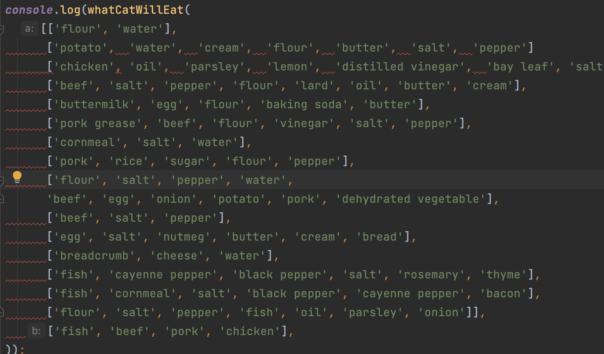

## Initial Thoughts
If I were to describe my first experiences with the “airbnb ”coding standards, I would describe it similar to that feeling when your dog won’t stop barking at 3:00 AM or when the ground beneath the chair you’re sitting on is uneven. It’s just not comfortable. As I’m sure is the case for most people, I like my code to look a certain way. Catering to personal preferences makes everything easier for us, the developers. Everyone knows this is true, but the sad reality is, the developer’s preference of format usually doesn’t matter for the code they write. Many of us work for startups or corporations that have their own code standards, so we always have to cater to their preferences instead of our own. It makes sense for us to experience different code standards, as it mimics software development practices in the real world. For the developer, it certainly doesn’t make anything easier, but that’s why they pay us.

I couldn’t care less about making a couple changes to the way I write code. The only thing that really irks me is seeing a bunch of red squiggly lines and a console full of error messages, as I write the code. If you’d let me finish writing the code, it would look a lot prettier! I promise! Truthfully, most of my gripes have less to do with the actual code standards, and more with eslint and how it handles exceptions.

  

## My Current Stance

I was recently shown a way to resolve all the eslint errors at once. It was an option in the right click dropdown menu towards the bottom. It was a very simple fix, and infinitely frustrating that I somehow managed to miss it up until that point, but I tend to do that a lot. My friends jokingly call me “the blind man that sees” for this exact reason. Now that I know how to make those red lines disappear, I would say I’m indifferent to using new code standards. I never really hated them, and I completely understand their practical uses, but console error messages stress me out. I think it’s great that we’re learning to use different formats because I need to practice adaptation. I am a creature of habit, and muscle memory has been my closest friend since day one, but that’s not gonna cut it for most jobs I may pursue in the future. The future is full of change.
