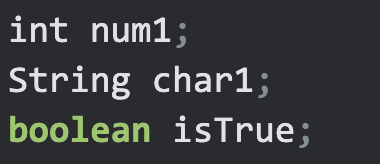
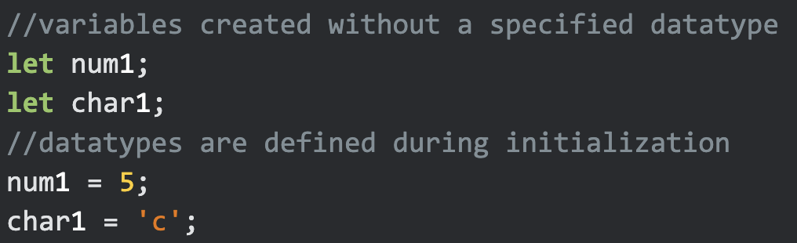
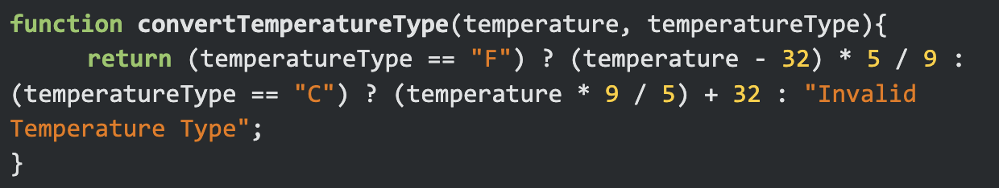

## My Initial Thoughts

If you’ve read my title, then chances are, you’ve either understood my terrible attempt at comedy,  and I’ve made an awful first impression, or it’s gone right over your head, and you will be able to read this essay without imagining it being spoken by a dad with some bad jokes. All jokes aside, these are my first impressions of JavaScript. I have never coded in this language before. It has always been one of those coding languages that I knew existed, but never actually touched until now. The forbidden fruit. To be completely candid, I was nervous about learning the fundamentals of a new language in such a short period of time. I am happy to report that it’s easy! No, I’m serious! After seven years of learning various languages such as Python, Java, C, C#, C++ and more, one learns to recognize similarities in syntax and structure of code. If I had to spell it out simply, it was like learning a new game, similar to one I’m very familiar with, but with a few new rules. These “new rules” represent a few things in JavaScript, most of which are syntax related. One example of this would be how variables are defined. In languages like Java, variables are defined by type upon creation.

  

JavaScript also defines variables by type, but while Java requires the user to define the datatype during creation, JavaScript is able to define the datatype of a variable automatically, based on the value assigned to it during initialization.

  

This type of flexibility creates more possibilities for function parameters, allows the user to define multiple variables under the same name, with different types, much easier than Java would allow. This is one small example of the many advantages that come with JavaScript. Aside from the subtle, yet, advantageous differences in syntax, the rest of the code I encountered looked nearly identical to code I am familiar with. These include, but are not limited to: conditional statements, while and for loops, return statements, functions and function calls, etc. JavaScript fits like an old glove!

## Fiddling with ES6 and the Dreaded WOD

I completed the Basics of JavaScript module on FreeCodeCamp.org before moving on to the ES6 module. ES6 is essentially a streamlined JavaScript. Since I am a creature of habit, who eats the same six or seven things a week, I found all these changes and shortcuts a little overwhelming at first. Just like grandma, I’m a little old fashioned, even if there are new developments that are truthfully more efficient than the ways of old. It seems that ES6 has a shorthand for everything. New ways to write functions, store and access data, all while writing fewer lines of code. 
By all means, shortcuts should make coding easier right? I didn’t think so at first, but then came our first in-class practice WOD(Workout Of the Day) in ICS314. Dr. Moore gave us our prompt, a simple program that takes in a temperature value, and a character ‘C’ or ‘F’ that would determine whether the value was in Celsius or Farenheit. Based on the input, the program would return the value in Kelvin. The students were broken into pairs and were expected to work synchronously to find a solution. When Dr. Moore instructed us to start, I was prepared to use my traditional understanding of code, completely neglecting any type of shorthand. My approach was simple. I would use an if/else if statement to determine whether the character was ‘C’ or ‘F’, then execute the corresponding calculation and return the value in Kelvin. Just as I finished putting my game plan together, my partner, Jared, had already finished his solution. I was in absolute shock. I looked over at his screen, and saw that he applied ES6 to write out the whole function in a single line of code.

  

At this exact moment, I questioned my initial judgments about ES6. If I could master ES6, I could cut down my work time by a more than significant amount. That doesn’t sound too bad.
