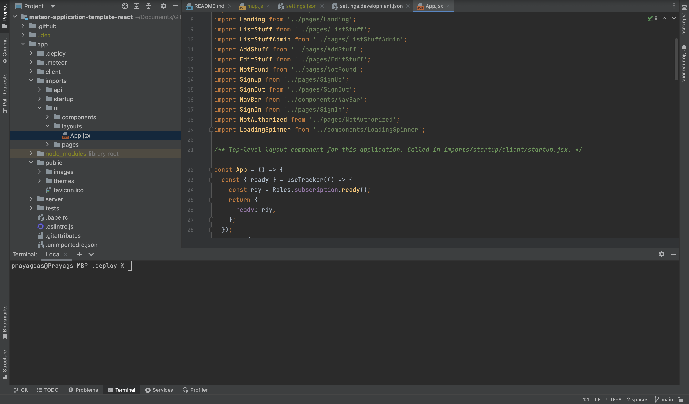

  

## Looking back on ICS 314

As I started this semester, I was coming out of a gap semester in which I did absolutely nothing in the field of coding. I was terrified that I was going to struggle to keep up with the new material and that I hadn’t remembered enough from previous semesters to succeed. 

As usual, I underestimated my own ability. The semester started with a crash course on JavaScript. This was perfect for me, as I had never worked in JavaScript before. All I really required for this course was a basic understanding of syntax and the ability to trace code, which I was excellent at.

From the introduction to JavaScript, we moved to using bootstrap and completed weekly WODs (Workout of the Day) starting on jsfiddle. As the weeks progressed, we made a smooth transition to using the IntelliJ Idea IDE. From here, we completed our weekly work and pushed our code to remote repositories on GitHub, a process we were also guided through early on in the class. The fact that the course was so incredibly “noob friendly,” made me so much more confident in my ability to learn and succeed. We learned the basics of UI, and HTML, styling using CSS, and applying both of these to working webpages using the ReactJS and Meteor frameworks. These are all terms I had no idea how to use when I started the course, but now it feels natural. 

The final lessons before we started our final project taught us to store data that could be used in the application using Mongo DB, and how to deploy our applications to working domains. This was the final stepping stone in learning how to build a functioning web application. 

Our final project started just over a month ago. This wasn’t the absolute first experience I had working on a group app development project, but it was the first time I worked with a group to create an application that was completely functional. There were a lot of hurdles to get over including, but not limited to, our timely and efficient cooperation, communication, and conflicting schedules. In the end, we had a mostly operational web application that applied all the front-end and back-end development techniques we learned over the course of the semester. We call our project Manoa Link, an app that connects local companies directly to university students with job opportunities and upcoming events. This experience definitely helps pave the way for how I take on new projects.

We concluded the semester with a small discussion on ethics. In my opinion, this was the perfect conclusion to this course, as we learned the importance of making ethical decisions and considering various perspectives when developing new ideas into working programs.

## Moving Forward

As I stated before, this class was my first exposure to ReactJS and Meteor. I also managed to build a small network of colleagues and met another student who was a part of UH Manoa’s ACM Board, Kobey Arai. He told me about a small club he was starting with the aim of helping teach students important, real-world skills for Software Development. I took the leap and said yes. This was one of the best decisions I’ve made so far. 

The software development club started out as a small group of students working together to build small web applications that the other clubs in ACM would use. What it boiled down to in the end, was Kobey mentoring me as we both worked on the application together. This one-on-one was super helpful for me, personally and I feel like I learned a lot through the experience. The application we worked on, was an attendance tracker for ACM events that utilized the ReactJS framework, which I now had a basic foundation for, and Google Cloud Firestore. Kobey walked me through the basics, and I applied what I learned from him to the application. It was a very pleasant experience working with him, and down the line, he gave me a referral for my current job at UH Groupings, a web development team on campus.

I think a lot of what I learned this semester helps me in my job, such as git command line, GitHub, and ReactJS to name a few things. I would definitely recommend this course to anyone who is thinking about taking it. It certainly helped me kickstart my career and opened a lot of doors for me.

Outside of web development, I think the time management and communication skills I’ve picked up will really help me organize many aspects of my day-to-day life. ICS 314 helped teach discipline and punctuality in completing my tasks, so I exit this class more prepared to take on the future in more ways than one.
