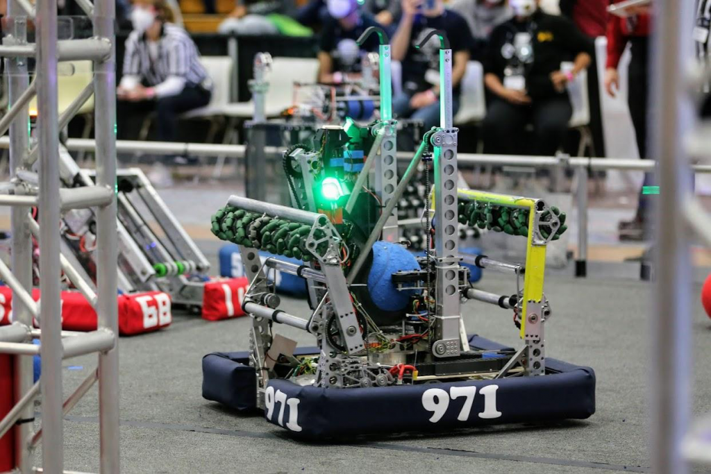

During my sophomore year of high school, I joined up with my school's robotics club, FRC(FIRST Robotics Competition) team 971. As a part of 971, I constructed robots, prototyped, coded robots, networked, and collaborated with large groups of students. Every year, the team was given a new game that we would have to design a robot to play. From the moment the game reveal video was dropped, we, the team of students, were responsible for prototyping robot designs, designing and manufacturing parts using SolidWorks, writing software for the mechanisms, and more. Aside from the robot's construction, we also coordinated our attendance of events like competitions or other social functions. In the 2018 season, I also served as the president of the team, giving me additional responsibilities as a liaison with the school for several on-campus events. More information about team 971 can be found [here.](http://frc971.org/)

  
  

