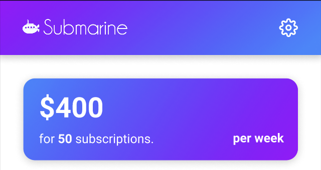
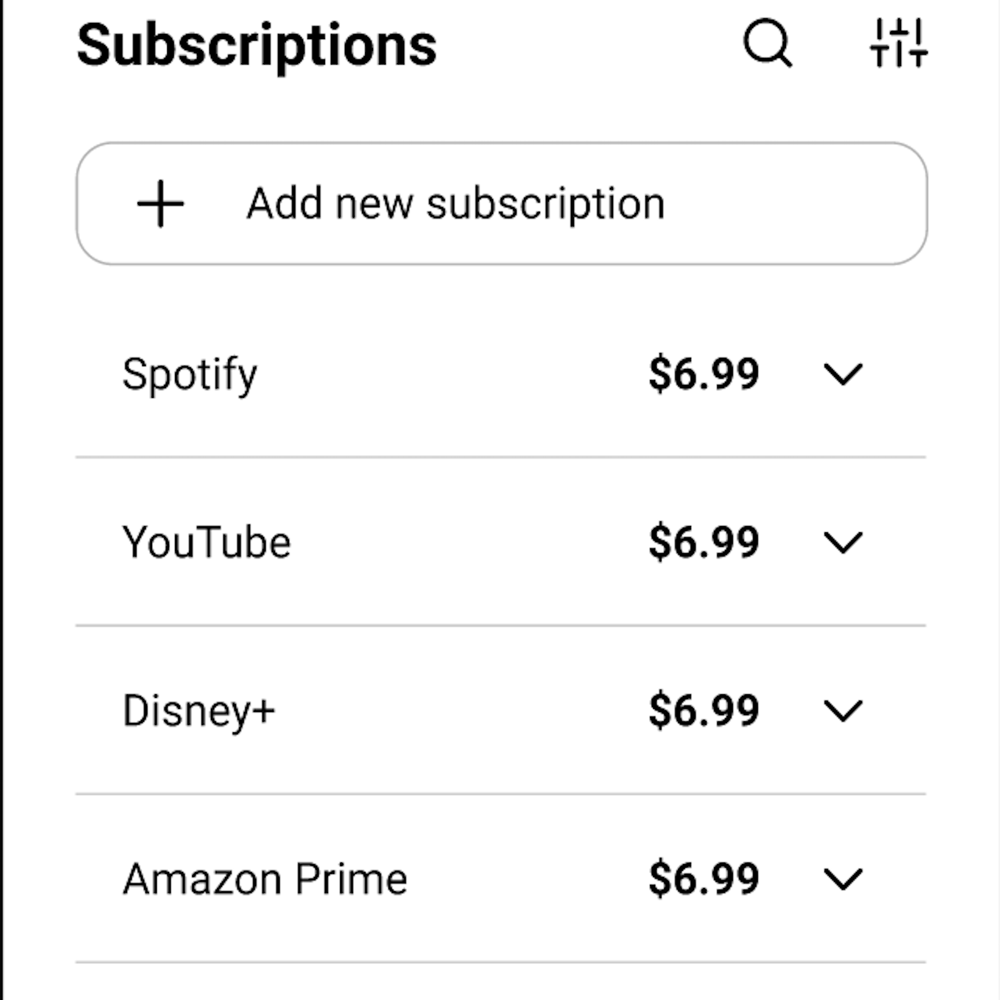

In Fall 2021, I was approached by my longtime friend, Andy Shi, who asked if I'd be interested in joining him, and a few other friends from class to participate in a Hackathon. Our goal was to create an application that has practical use in the real world. I proposed the idea of creating a subscription manager, since I always struggled to keep track of what I was paying for every month. We all agreed, and the project began to take shape. The Submarine Subscription manager was my team's submission in the Virtual CodeDay Winter 2021 Hackathon. This application allows the user to enter in their subscriptions and billing cycles to keep track of their expenses over time.

  

  

  

