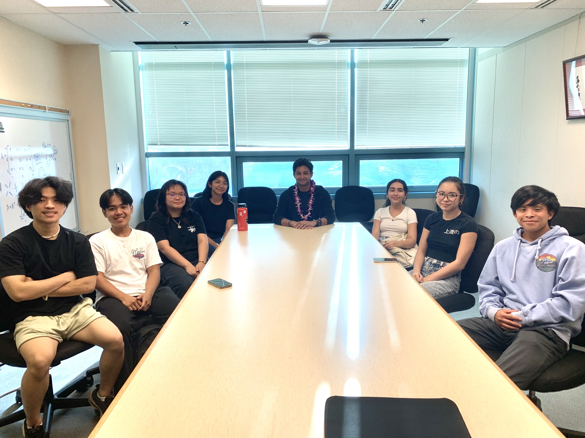
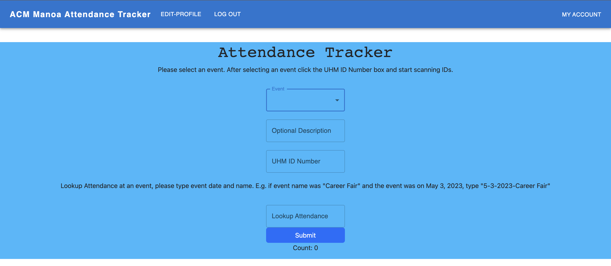
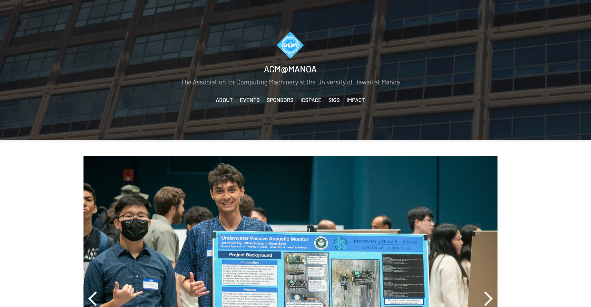

The ACM Manoa Software Development team provided an opportunity for newer software development students to gain hands-on experience building web applications with React projects. They also learned essential skills in team collaboration and Git via the command line.

One of our main projects was an Attendance Tracker for use by the club functions and career fairs. This project utilizes the ReactJS framework and Google's Firebase Cloud Firestore API Database to take in a selected club and student ID, then records them with a date and timestamp into a collection of documents inside the database. My contributions to this project consisted mostly of backend development on file writing to the database. Previously, I didn't have much experience using Google's Firebase API, so this was a great opportunity for me to learn its functionality for future projects.

  

  

  

