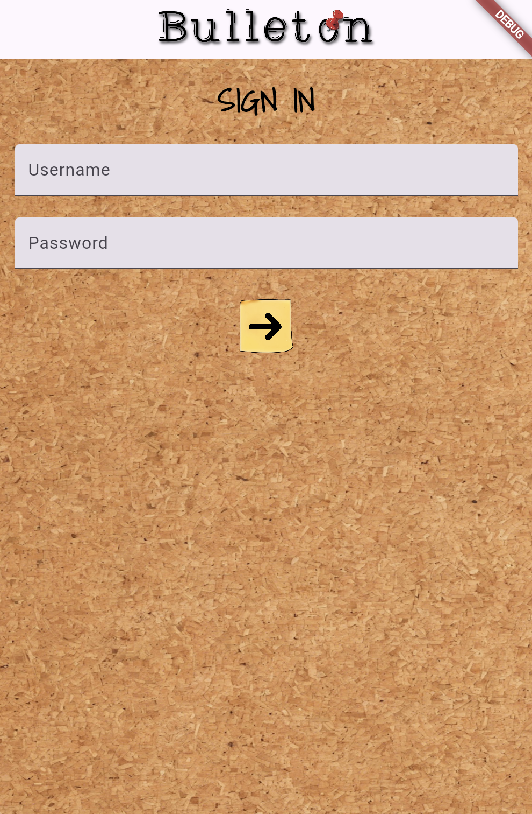
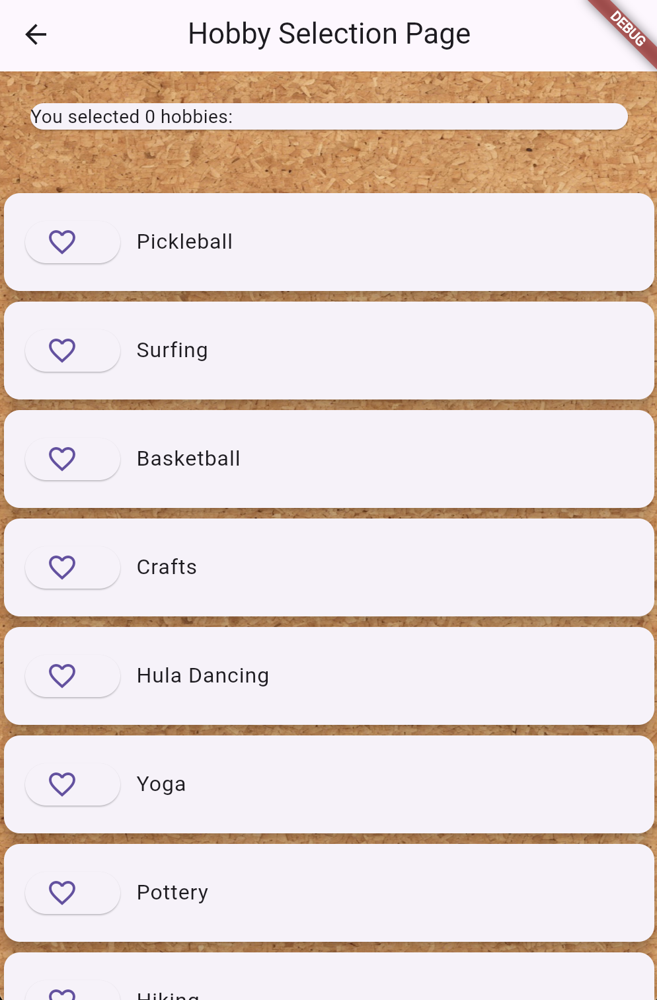
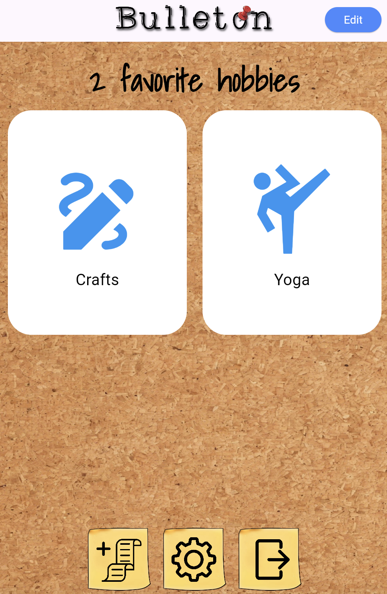

## Overview
Bulleton is a mobile app that serves as a centralized hub for users to find comprehensive information related to their specific hobbies or interests. Users can select a default hobby bulletin board with information feeds that we believe will be most useful, or they can customize their boards to display only the information they care about.

## My Experience
For my ICS 466 course, Design for Mobile Devices, we used Dart and Flutter to design mobile apps and learned introductory app marketing practices. I had the idea of creating an app that allows users to get all the latest information on their personal interests, removing a large portion of the overhead required. The app's interface needed to be simple and intuitive to compete against alternative options such as search engines. I designed the general structure of the app, along with many of the assets and visual elements seen on the user interface.

We recognized the potential for a user's bulletin board to quickly become overwhelming. To combat this, we chose to utilize easily recognizable icons instead of text (e.g., a gear for settings or a tennis racket icon for a tennis hobby). Therefore, our main goal was to verify that Bulleton's UI is simple to understand and to gather information for design improvements.

In our evaluation testing, a majority of our participants were college students. Regardless, we were able to carry out some methods of observation through think-aloud protocols for assigned tasks. The usability testing provided valuable insights into Bulleton’s design and functionality. Participants completed a series of tasks and answered a set of questions to evaluate the app’s usability, navigation, and visual aesthetics.

  
  
  

