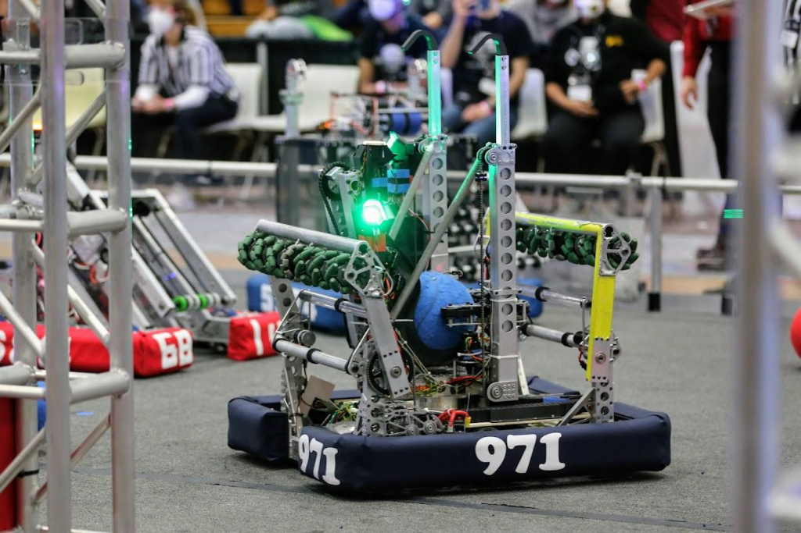
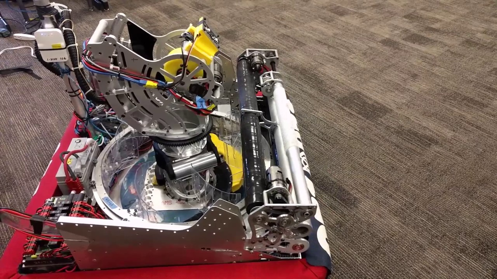

“Bulleton” is a unique app designed to keep users fully informed about the topics and activities they care about. Whether you're into sports, music, technology, or niche hobbies, our platform curates the latest news, events, and spots around your area that align with your interests. By simply selecting your hobbies and passions, Bulleton customizes your feed with content that speaks to you, allowing you to stay in the loop on what matters most.

  
  

