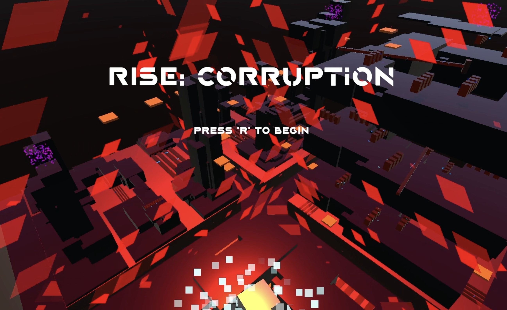
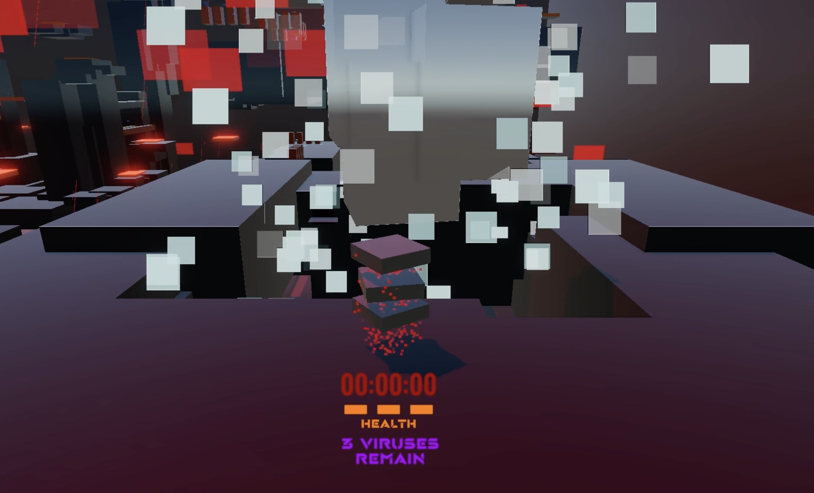
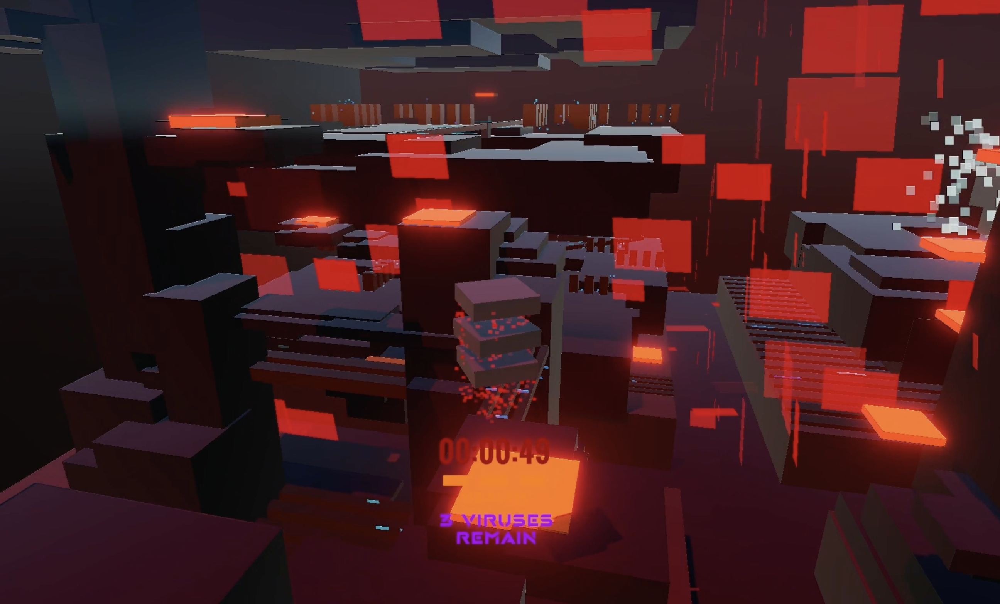
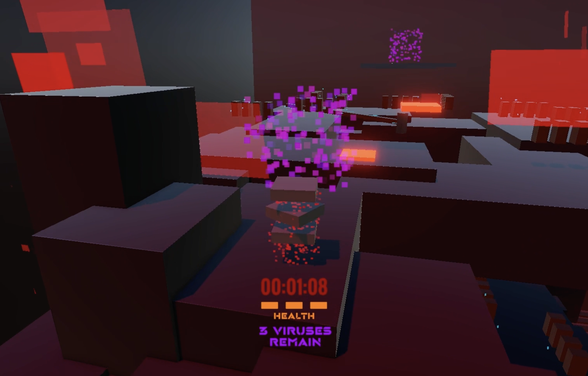
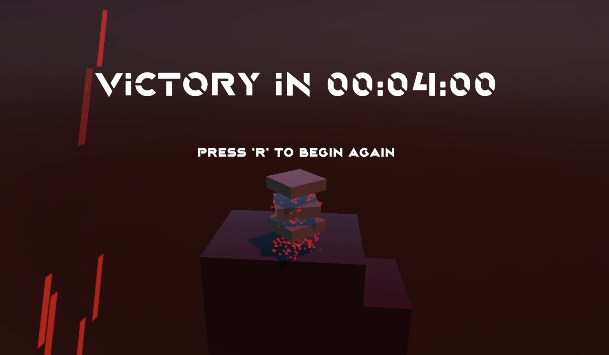

## Overview
RISE: Corruption is the first in what hopes to be a series of games in a shared universe. You play an antivirus robot tasked with purging a computer of harmful viruses. Roam across the computer's hardware components, using WASD to move and SPACE to jump, while avoiding live wires that will deplete your three lives.

There are three distinct zones, each infected with a virus. Once you eliminate a zone's virus, a teleporter to the next section activates. On any playthrough, the order of these zones is randomized, ensuring a new experience each time you play. You must clear all three zones to win the game.

## My Experience
This game was my submission for the first project in my game development class. The purpose of this solo project was to showcase our individual skills, which helped us form groups for the next project. We were given a very simple rubric with basic requirements, allowing a lot of room for creativity. One requirement was that everything in the game needed to be cubic, and another was that it had to include an item collection mechanic.

I've always been a fan of TRON's aesthetics and visuals, so I used them for inspiration. I designed several structures using cubic objects with a dark, glossy surface material. Having made basic games in Unity during high school, I found it super easy to pick up the software again. A friend showed me how to use a basic particle system in Unity, which I then incorporated to give my game bright colors and attention-grabbing visuals.

I designed a map with three distinct zones, each different in look and feel. This forces the player to adapt their movement strategy for each area. I also introduced a timer and a system that randomizes these zones on each replay. This challenges the player to strategize the quickest way to complete each zone and secure the win.

  
  
  
  
  

