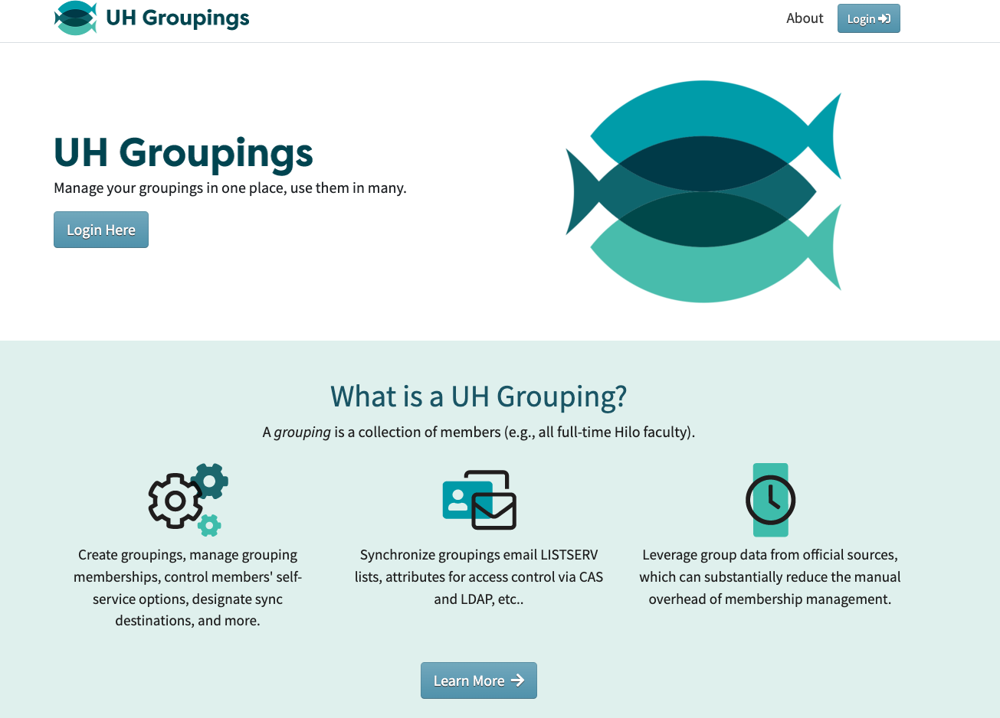

## Overview
UH Groupings is a web service dedicated to organizing, managing, and utilizing groups of people within the University of Hawaii system. Groupings make it easier to control access, distribute information, and maintain accurate member lists across the various University of Hawaii systems.

## My Experience
I joined the UH Groupings team as a student hire in March 2023. At the time, I had only a basic understanding of React from an intro to software development class and didn't have much experience developing code in a team setting. During these two years, I sharpened my understanding of Git command line, ReactJS, and AngularJS, and became more comfortable with my communication and collaboration skills. In my last two terms, I took on various leadership roles to help newer team members better understand the project before my fellow seniors and I departed. I would recommend this experience for any first or second-year students at UH Manoa who are interested in learning about web application design and want to gain experience in team development.

The deployed UH Groupings website can be found [here](https://www.hawaii.edu/its/uhgroupings/).

  

