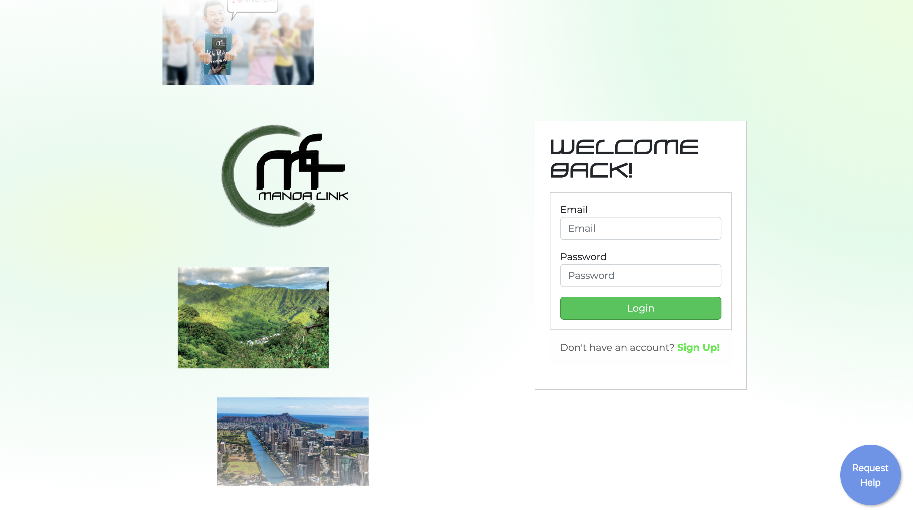
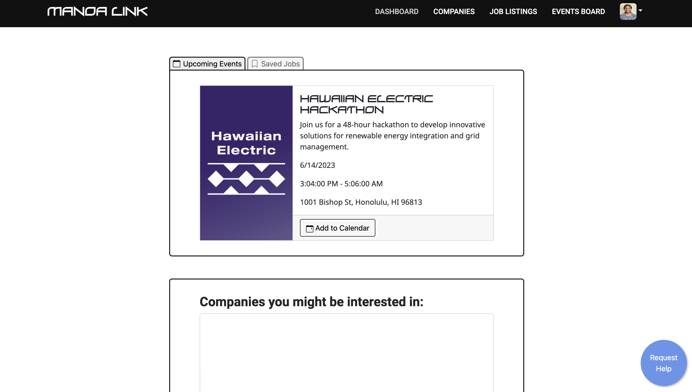
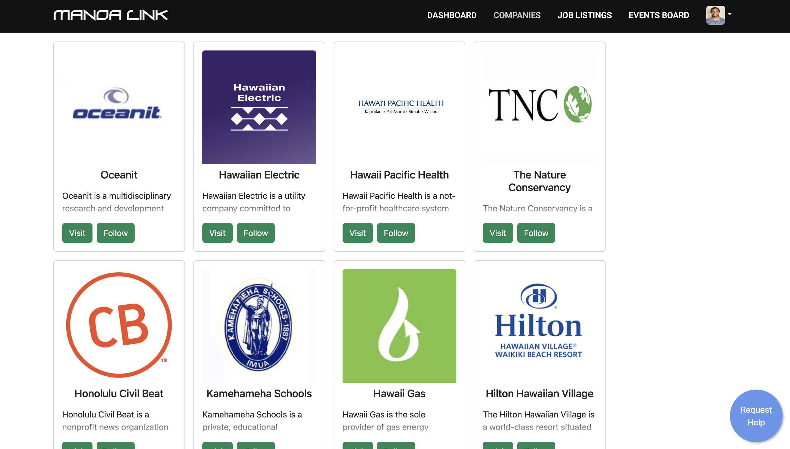
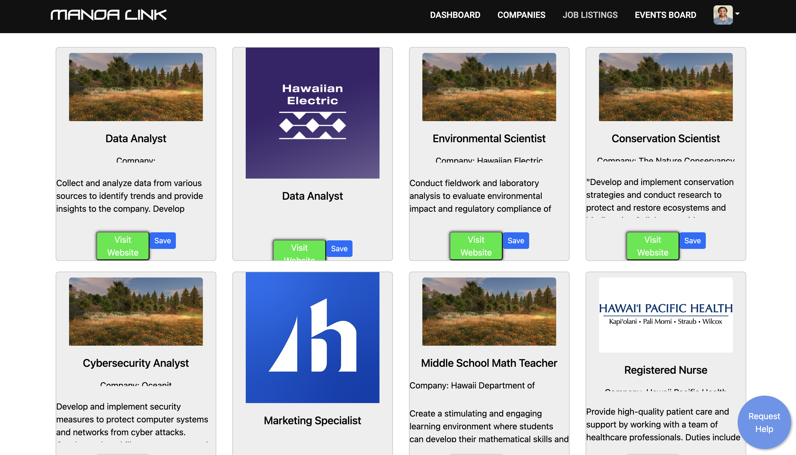
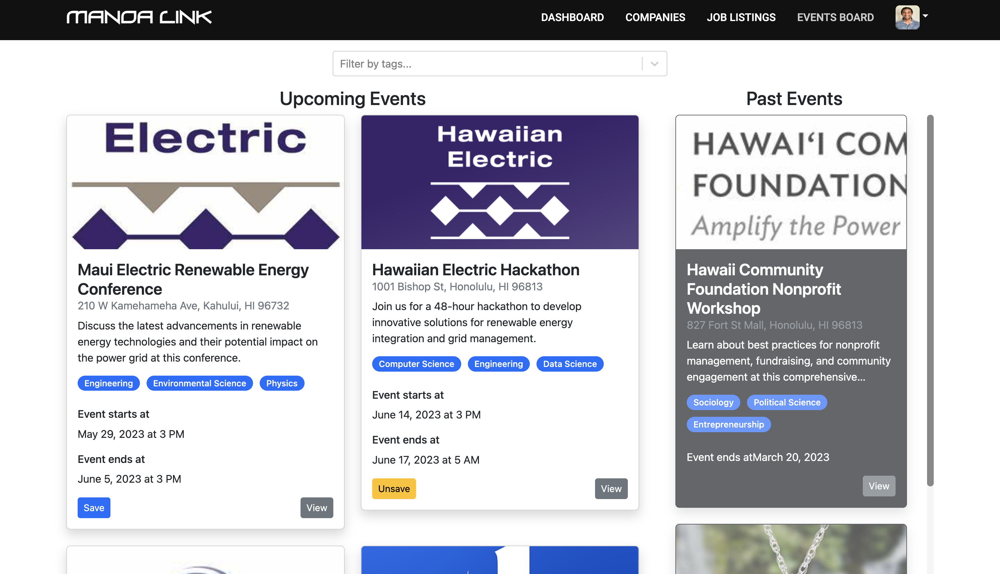
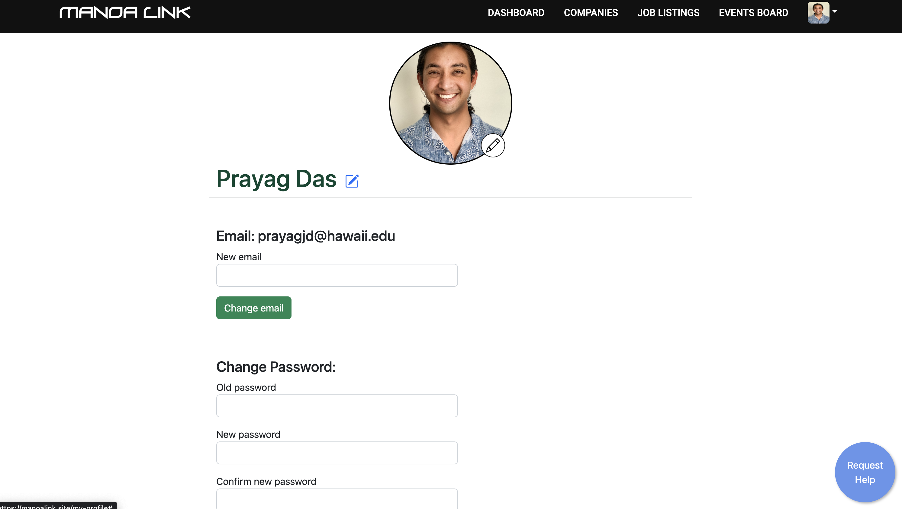

## Overview
For my final project in ICS 314: Software Engineering One, I worked in a team of four to develop Manoa Link, an app whose purpose is to connect companies to university students directly by posting job openings, internships, and other opportunities. Businesses can create a user profile and post their job listings on a page where students can view and save the ones they're interested in. Companies also have the option of adding upcoming events to their profiles, which will become visible to students when they follow companies or add jobs to their dashboard.

The deployed site can be found [here.](https://manoalink.site/)

  
  
  
  
  
  

