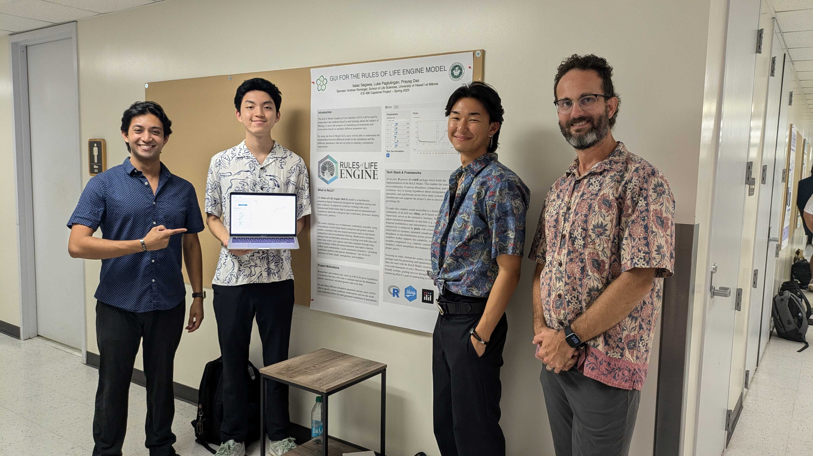

## Overview
The ROLE Model is a mechanistic, simulation-based framework designed for hypothesis testing and data synthesis. It empowers scientists working with multi-dimensional biodiversity data to generate and test parameterized 
hypotheses about the ecological and evolutionary processes shaping biodiversity patterns. The model simulates eco-evolutionary community assembly using
a foundation of individual-based ecological and genetic neutral models, extended with non-neutral processes such as trait-based competition and environmental filtering. Biodiversity dynamics
emerge from evolutionary processes occurring over both long and short time scales: new species and traits originate through long-term evolution within the metacommunity and rapid evolution
within local communities. Local community dynamics—including population genetics and species abundances—are driven by processes of birth, death, immigration, and mutation.

At its core, R powers the roleR package which holds the implementation of the RoLE Model. This enables the simulation eco-evolutionary of species abundance, competition, and trait
evolution—key to testing hypotheses about immigration, speciation, and equilibrium across three study systems. This foundational tool supports the project’s aim to uncover the rules governing life. To make this complex model accessible to a broad scientific
community of all skill sets, Shiny, an R-based web application framework, serves as the interactive interface. Shiny allows users to adjust simulation parameters in real time (e.g., speciation rates or dispersal probabilities) and immediately visualize the results. This
interactivity is enhanced by plotly with a foundation of ggplot2, which delivers dynamic, animated visualizations—such as tracking abundance or trait distributions across generations. Shiny’s modular workflow further supports this scalability, organizing code into
reusable components (e.g., controls, simulation, and plotting modules), which streamlines development and maintenance as the project grows.

## My Experience
In my final semester at UH Manoa, I contributed to creating the ROLE GUI (Graphical User Interface) for my senior capstone project, collaborating with two other students. Dr. Andrew Rominger from the School of Life Sciences was our assigned sponsor for the project, and he introduced us to the existing ROLE GUI.

While my partners and I had experience in web development from working at UH Groupings, we were new to R and R Shiny, conducting extensive research before starting the project. We met with our sponsor weekly to provide updates and present mockup designs, which we would later implement into the app. At the end of the term, we presented our work at the ICS (Information and Computer Sciences) Project Day event.

This project is currently still in progress and is planned for use in a scientific research paper with the UH Manoa Life Sciences Department in Fall 2025.

  

  
  

  

