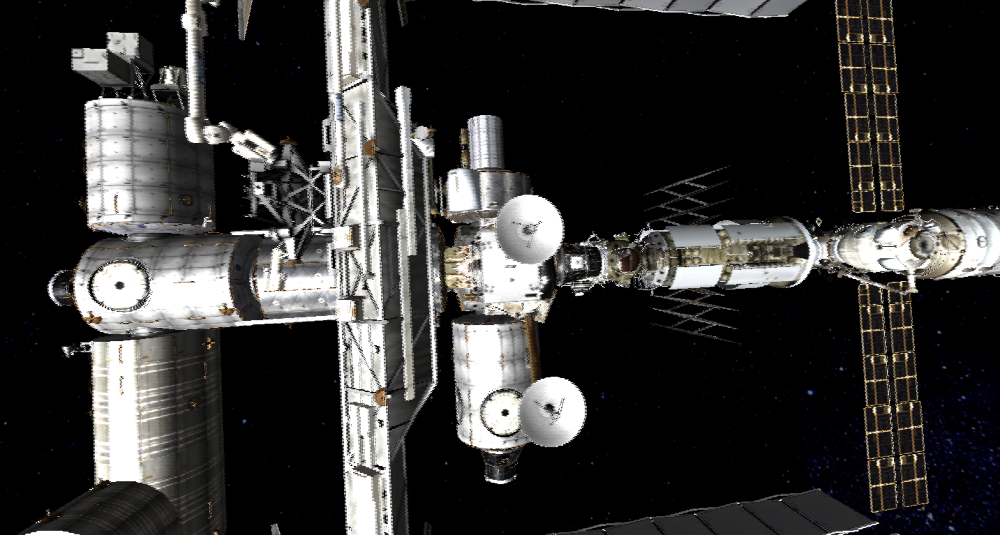

## Overview
This app uses the Three.js library to render a 3D scene for use on the display walls at UH Manoa's [LAVA](https://www.lavaflow.info/) lab.

## My Experience
I'm currently working on this project as a post-graduate volunteer for LAVA. So far, I have familiarized myself with the project files, corrected the camera's launch position, and added a few new controls for camera movement and rotation. 

I will update this page with more developments as they happen.

  
  

