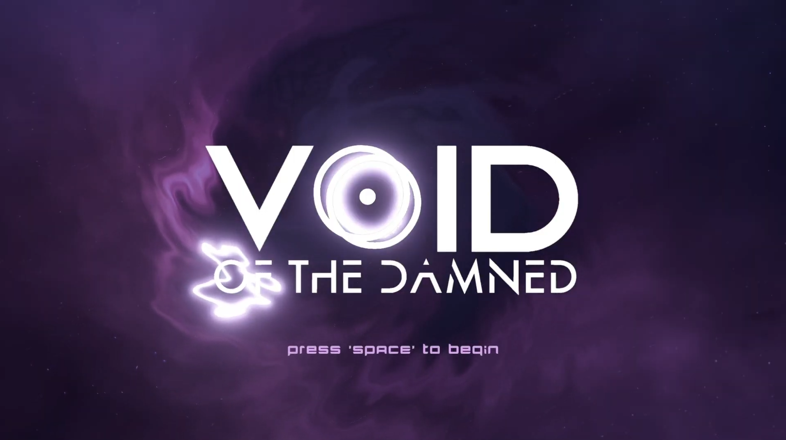
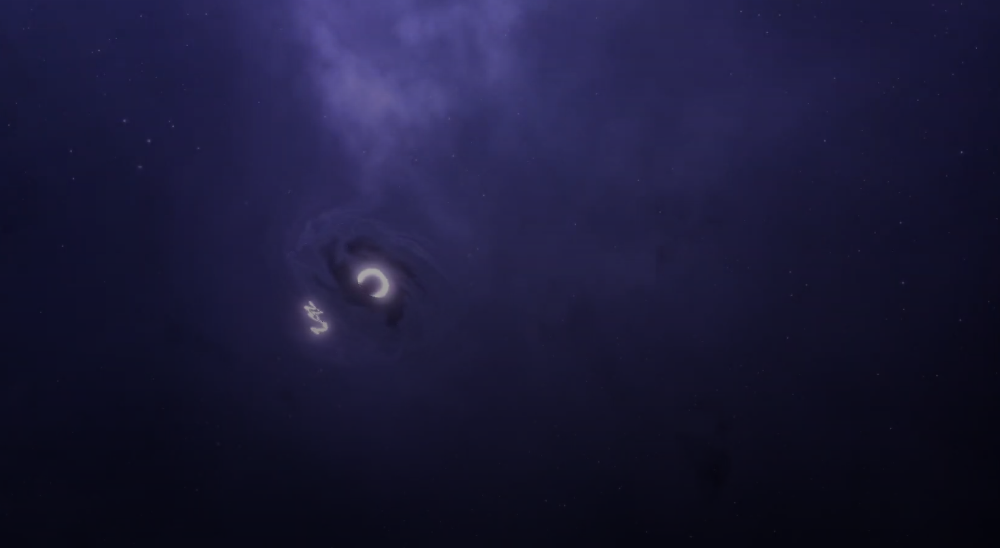
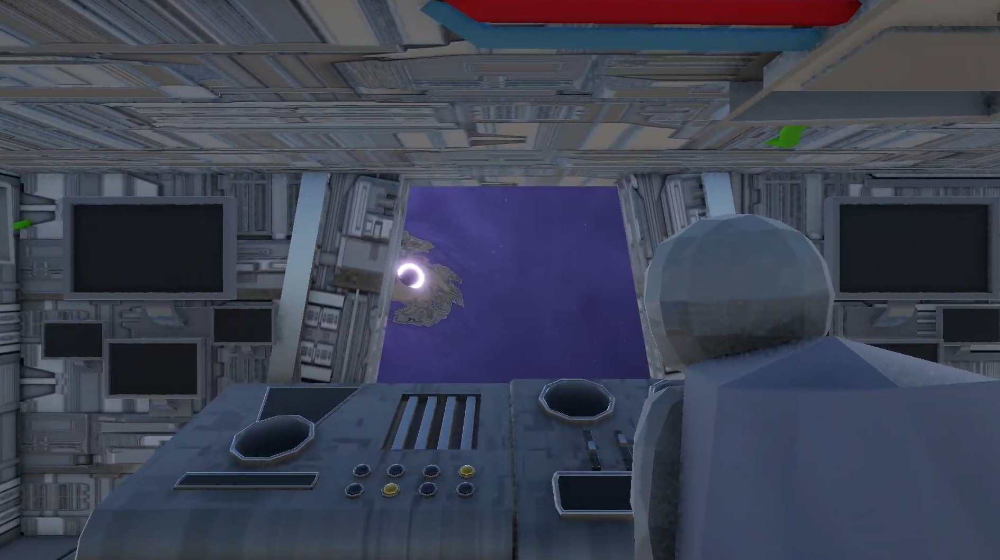
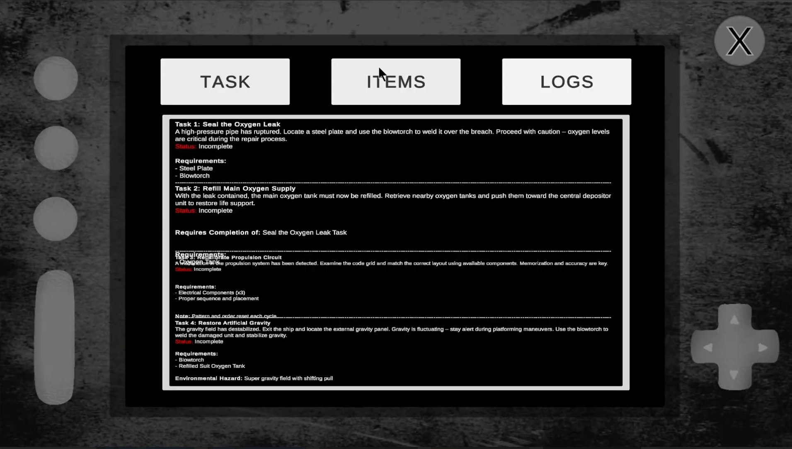
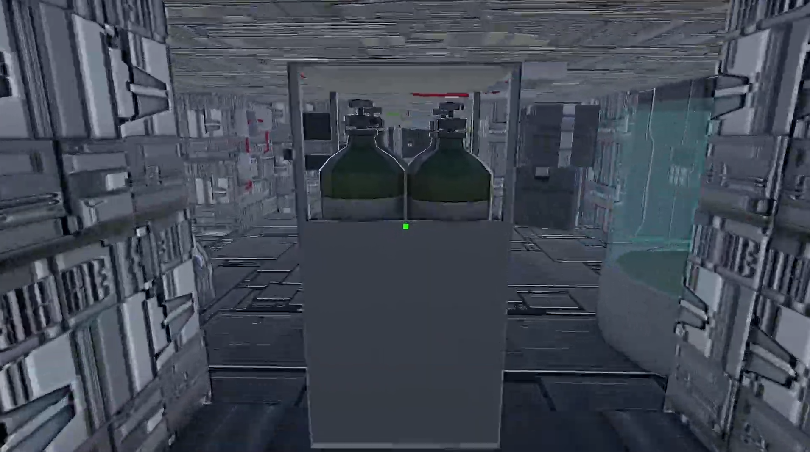
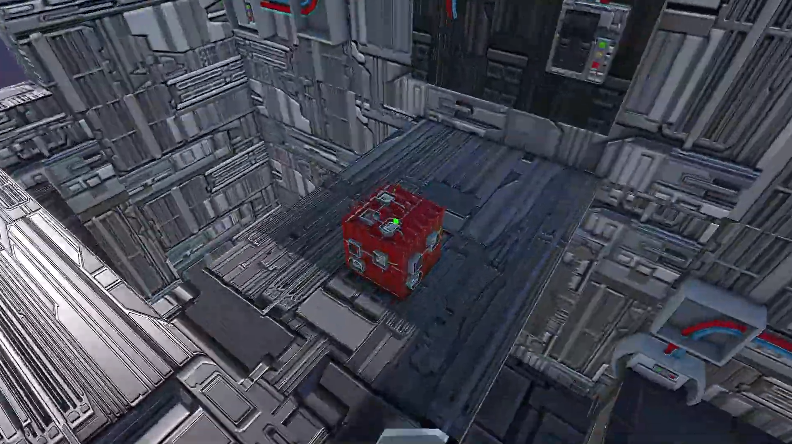

## Overview
Void of the Damned was my submission for the final project of my game design class. In this first-person thriller, you play as an astronaut who wakes up on an abandoned space station without any memory of how he got there. He notices that the station is slowly moving towards a black hole, and he must fix the station's critical systems to steer clear before it's too late, all while holding onto his sanity.

## My Experience
For this project, our professor asked us to form groups of three to four people. Our previous assignment was a solo project, which we presented to the class, showcasing our individual work and skills. I selected two partners for my team after watching their demo videos and identifying parts of their games that could be useful when combined with mine. When we started the development process, we used ChatGPT to generate a list of game ideas. We took pieces of different ideas and combined them into our final concept for Void Of The Damned, a space game where the player races against the clock. I wanted to go beyond the basic project requirements, so I had the idea of creating a random map generation algorithm, giving the player a new experience on every playthrough.

After finalizing our game idea, we split up tasks based on our skill sets. My main responsibilities were designing the map generation algorithm and environments. Additionally, I needed to ensure my maps and environments worked with the game mechanics that my partners implemented.

The website for our game can be found [here](https://prayagjd.wixsite.com/void-of-the-damned).

  
  
  
  
  
  

